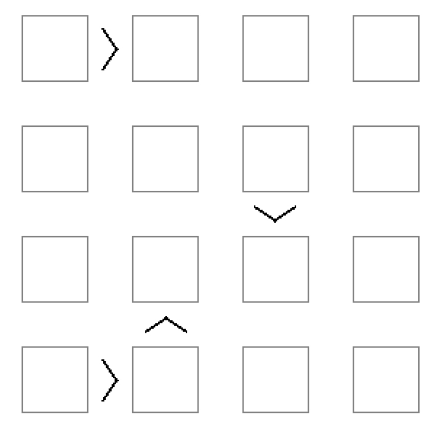
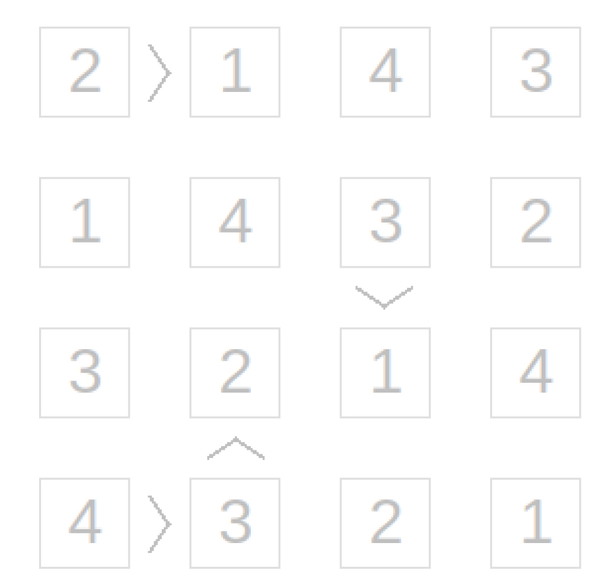

# Program to validation the puzzle
Solution validator for a board game similar to Sudoku. The game has an n by n board. Each row and column will be filled by numbers between 1 and n. Like Sudoku, each number can appear once and only once in each row and each column. But unlike Sudoku some adjacent cells have additional constraints between them. For example, in the board shown below cell (1, 1) should be greater than cell (1, 2), cell (2,3) should be greater than cell (3,3), and so on.

* for example,
    * empty board
    
    * sample solution
    

* to run the program with custom values
    * make sure python > 3.7 is installed
    * fill in the solution, N value and constrains in solution.execution.py
    * save & execute

```bash
    python solution.execution.py
```

* to run the program after logic changes (TDD or debug mode)
    -  make sure python > 3.7 is installed
    - Assertions are available when executing the module as main script to validate the logic.
```bash
    python validate_puzzle.py
```    

* Notes
    * Same can be achieved using Numpy methods. This is created using basic Python data structures
    * logging is always set to run in DEBUG while executing the Module and Info while executing from outside. Module can be extended to include logging handlers and custom log levels. 
